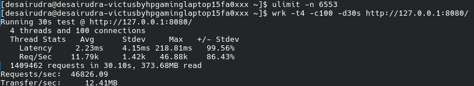
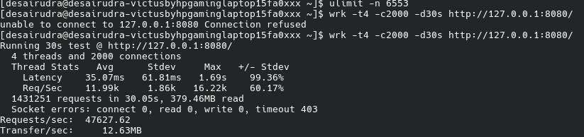
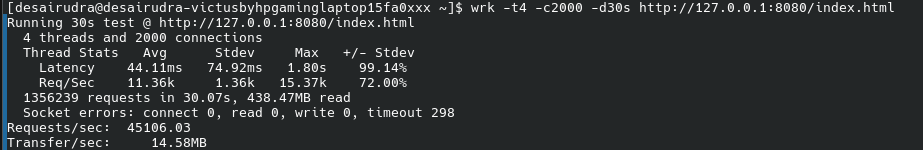

# HTTPServerFromScratch

A multithreaded HTTP/1.1 server built completely from scratch in Modern C++ using POSIX sockets, Linux `epoll`, non-blocking I/O and a custom thread pool.

The objective of this project was to understand how web servers work internally by implementing the networking stack myself instead of relying on existing networking libraries or frameworks. The project gradually evolved from a simple blocking socket server into an event-driven HTTP server capable of handling thousands of concurrent client connections.

---

## Features

### HTTP

- HTTP/1.1 GET request handling
- Persistent Keep-Alive connections
- Static file serving
- Custom routing
- MIME type detection
- Custom 404 page

### Networking

- POSIX TCP sockets
- Non-blocking sockets
- IPv4 / IPv6 support
- SO_REUSEADDR

### Event Driven Architecture

- Linux epoll
- EPOLLONESHOT
- EPOLLERR
- EPOLLHUP
- EPOLLRDHUP

### Concurrency

- Custom Thread Pool
- Fixed worker threads
- Concurrent request processing
- Thread-safe logging

### Connection Management

- Idle connection timeout
- Graceful client disconnect handling
- Persistent HTTP connections

---

# Project Structure

```text
HTTPServerFromScratch
│
├── benchmark
│   ├── simpleload.png
│   ├── heavyload.png
│   ├── heavyload_html_file.png
│   ├── simpleload.txt
│   └── heavyload.txt
│
├── content
│   ├── index.html
│   ├── helloworld.html
│   ├── style.css
│   ├── script.js
│   ├── img.png
│   └── 404.html
│
├── include
│   ├── HttpRequest.h
│   ├── HttpResponse.h
│   ├── Logger.h
│   ├── Server.h
│   └── ThreadPool.h
│
├── src
│   ├── main.cpp
│   └── ThreadPool.cpp
│
├── CMakeLists.txt
└── README.md
```

---

# Architecture

```
                      Browser
                          │
                    HTTP Requests
                          │
                  Listening Socket
                          │
                     epoll_wait()
                          │
       ┌──────────────────┴──────────────────┐
       │                                     │
Accept New Connection              Existing Client Ready
       │                                     │
 Add Socket to epoll             Push Socket to Thread Pool
                                             │
                                      Worker Thread
                                             │
                                   Parse HTTP Request
                                             │
                                   Generate Response
                                             │
                                           send()
```

The main thread is responsible only for accepting new connections and monitoring sockets using `epoll`. Once a socket becomes ready for reading, it is pushed into the thread pool where a worker thread processes the HTTP request and sends the response. `EPOLLONESHOT` ensures that only one worker thread owns a socket at any point in time.

---

# Building

## Requirements

- Linux
- GCC (C++17)
- CMake >= 3.16
- POSIX Threads

Clone the repository

```bash
git clone https://github.com/desairudra/HTTPServerFromScratch.git

cd HTTPServerFromScratch
```

---

## Build using CMake

```bash
mkdir build

cd build

cmake ..

make
```

Run

```bash
./HTTPServerFromScratch
```

The server listens on

```
http://localhost:8080
```

---

# Benchmark

Benchmarks were performed on **Fedora Linux** using **wrk**.

### Benchmark Environment

- Operating System : Fedora Linux
- Compiler : GCC (C++17)
- Thread Pool Size : 8
- HTTP Version : HTTP/1.1
- Keep-Alive : Enabled

---

## Benchmark Prerequisites

To reproduce the heavy-load benchmark, increase the maximum number of open file descriptors before starting the server.

```bash
ulimit -n 65536
```

Without increasing this limit, the operating system may reject new connections before the server reaches the intended concurrency level.

---

## Benchmark Summary

| Test | Connections | Requests/sec | Average Latency |
|------|------------:|-------------:|----------------:|
| Simple Load | 100 | **46,826** | **2.23 ms** |
| Heavy Load | 2000 | **46,272** | **33.74 ms** |

---

# 1. Simple Load

Command

```bash
wrk -t4 -c100 -d30s http://127.0.0.1:8080/
```

Result

- 46,826 requests/sec
- 2.23 ms average latency
- Zero socket errors

### Benchmark Screenshot



### Raw Benchmark Output

Available at

```
benchmark/simpleload.txt
```

---

# 2. Heavy Load

Command

```bash
wrk -t4 -c2000 -d30s http://127.0.0.1:8080/
```

Result

- 46,272 requests/sec
- 33.74 ms average latency
- 1,390,201 requests completed
- 426 socket timeouts

### Benchmark Screenshot



### Raw Benchmark Output

Available at

```
benchmark/heavyload.txt
```

### Note

During the stress test, `wrk` reported **426 socket timeouts** out of approximately **1.39 million requests** (~0.03%). These occurred only during maximum-load benchmarking on localhost while the server continued processing the overwhelming majority of requests successfully.

---

# 3. HTML Resource Benchmark

To evaluate serving multiple static assets, the server was benchmarked while serving an HTML page containing external CSS, JavaScript and image resources.

The browser issues multiple concurrent requests over persistent HTTP connections, which are processed concurrently by the worker threads.

### Benchmark Screenshot



---

# Logging

Each request records

- Client IP
- HTTP Method
- Requested Resource
- HTTP Status Code
- Worker Thread ID
- Socket Descriptor

Example

```text
[2026-07-09 12:04:28]
127.0.0.1 GET /index.html 200 thread_id:139952421660352 socket id:5
```

---

# Design Decisions

### Why epoll?

Unlike `select()` and `poll()`, Linux `epoll` reports only sockets that are ready for I/O, making it suitable for handling thousands of concurrent connections efficiently.

### Why a Thread Pool?

Creating a new thread for every connection introduces significant overhead. A fixed-size thread pool allows worker threads to be reused while keeping thread creation costs low.

### Why Non-blocking Sockets?

Non-blocking sockets prevent worker threads from waiting indefinitely on slow clients, allowing the server to continue processing other requests.

### Why EPOLLONESHOT?

`EPOLLONESHOT` guarantees exclusive ownership of a socket by a single worker thread until request processing is complete, preventing race conditions on persistent connections.

### Why Keep-Alive?

Persistent HTTP connections allow multiple requests to be served over the same TCP connection, reducing handshake overhead and improving throughput.

---

# Technologies Used

- Modern C++17
- POSIX Sockets
- Linux epoll
- TCP/IP
- HTTP/1.1
- Multithreading
- STL

---

# What I Learned

Building this project gave me practical experience with

- Linux systems programming
- POSIX socket programming
- TCP connection lifecycle
- HTTP/1.1 protocol
- epoll
- Event-driven server design
- Non-blocking I/O
- Thread pools
- Synchronization using EPOLLONESHOT
- Performance benchmarking using wrk

One of the biggest challenges was designing a thread-safe interaction between `epoll` and worker threads while ensuring that only one thread processed a client socket at any given time.

---

# Future Improvements

- HTTP POST support
- Chunked Transfer Encoding
- Zero-copy file transfer using `sendfile()`
- HTTP caching (`ETag`, `Last-Modified`)
- HTTPS (OpenSSL)
- HTTP/2 support
- Configuration file support

---

# Author

**Rudra Desai**

GitHub: https://github.com/desairudra

If you find this project interesting, feel free to ⭐ the repository.